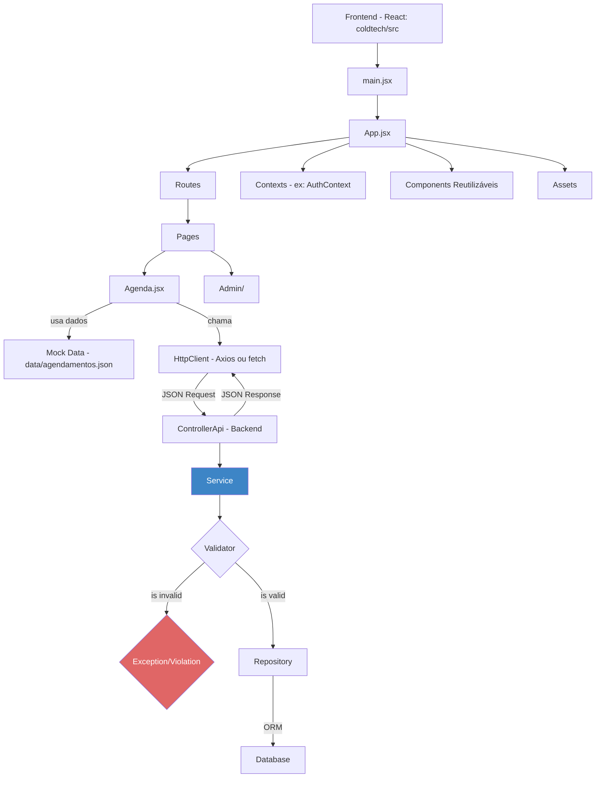

# ColdTech - Sistema de Gerenciamento de Manutenção de Ar Condicionado

## Visão Geral

ColdTech é um sistema web para gerenciamento de serviços de manutenção de ar condicionado. A plataforma permite o agendamento de serviços, gerenciamento de clientes e acompanhamento de manutenções.

## Funcionalidades

- **Site Institucional**: Apresentação da empresa e serviços
- **Agendamento de Serviços**: Interface para clientes agendarem manutenções
- **Painel Administrativo**: Gerenciamento completo do sistema
  - Dashboard com indicadores de desempenho
  - Gerenciamento de agendamentos
  - Cadastro e acompanhamento de clientes
  - Configurações do sistema

## Tecnologias Utilizadas

- React.js
- React Router
- Tailwind CSS
- Armazenamento local (localStorage)

## Estrutura do Projeto

```
coldtech/
├── src/
│   ├── assets/           # Recursos estáticos (imagens, etc)
│   ├── components/       # Componentes reutilizáveis
│   ├── contexts/         # Contextos React (AuthContext)
│   ├── data/             # Dados mockados (agendamentos.json)
│   ├── pages/            # Páginas da aplicação
│   │   ├── Admin/        # Componentes do painel administrativo
│   │   └── Agenda.jsx    # Página de agendamento
│   ├── routes/           # Configuração de rotas
│   ├── App.jsx           # Componente principal
│   └── main.jsx          # Ponto de entrada
└── public/               # Arquivos públicos
```

## Instalação e Execução

1. Clone o repositório
2. Instale as dependências:
   ```
   npm install
   ```
3. Execute o projeto:
   ```
   npm run dev
   ```

## Acesso ao Sistema

- **URL do site**: /
- **URL do agendamento**: /agenda
- **URL do painel admin**: /admin
- **URL de login**: /login

## Credenciais de Acesso

Para acessar o painel administrativo:
- **Email**: admin@coldtech.com
- **Senha**: admin123

## Principais Componentes

### Site Institucional
- **HomePage**: Página inicial com apresentação da empresa
- **Navbar**: Barra de navegação principal
- **HeroSection**: Seção de destaque com chamada para ação
- **ServicesSection**: Apresentação dos serviços oferecidos
- **CTASection**: Chamada para ação (Call to Action)
- **Footer**: Rodapé com informações de contato

### Sistema de Agendamento
- **Agenda**: Página para visualização e criação de agendamentos
- **Table**: Componente de tabela para exibição dos agendamentos

### Painel Administrativo
- **Dashboard**: Layout principal do painel administrativo
- **DashboardHome**: Página inicial com indicadores e estatísticas
- **AgendamentosAdmin**: Gerenciamento de agendamentos
- **ClientesAdmin**: Gerenciamento de clientes
- **Navbar/Sidebar**: Navegação do painel administrativo

## Autenticação

O sistema utiliza um contexto de autenticação (AuthContext) para gerenciar o estado de login do usuário. Os dados são armazenados no localStorage para persistência entre sessões.

## Rotas Protegidas

O componente PrivateRoute garante que apenas usuários autenticados possam acessar o painel administrativo.

---

Desenvolvido como projeto demonstrativo para a ColdTech Manutenção de Ar Condicionado.



