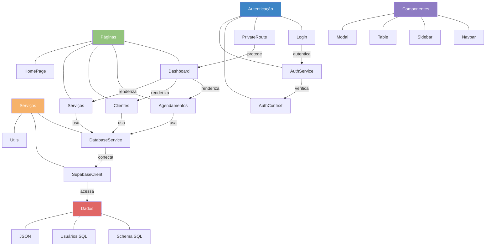

# ColdTech - Sistema de Gerenciamento de Agendamentos

## Sobre o Projeto

Sistema de gerenciamento de agendamentos para serviços de manutenção, instalação e outros serviços relacionados a refrigeração. O sistema permite controlar agendamentos, clientes, serviços e gerar relatórios de faturamento.

## Tecnologias Utilizadas

- React 
- Vite
- Supabase (Banco de dados PostgreSQL)
- bcryptjs (Criptografia de senhas)
- React Router (Navegação)
- Context API (Gerenciamento de estado)

## Configuração do Projeto

### Pré-requisitos

- Node.js (v14 ou superior)
- npm ou yarn
- Conta no Supabase

### Instalação

1. Clone o repositório
2. Instale as dependências:
   ```
   npm install
   npm install bcryptjs
   ```
3. Configure as variáveis de ambiente:
   - Crie um arquivo `.env` na raiz do projeto com as seguintes variáveis:
   ```
   REACT_APP_SUPABASE_URL=sua_url_do_supabase
   REACT_APP_SUPABASE_ANON_KEY=sua_chave_anonima_do_supabase
   ```

### Configuração do Banco de Dados

1. Crie um projeto no Supabase
2. Execute os scripts SQL na seguinte ordem:
   - `supabase/schema.sql` - Cria as tabelas principais (serviços, clientes, agendamentos)
   - `supabase/usuarios.sql` - Cria a tabela de usuários para autenticação

### Credenciais de Acesso

- **Email**: admin@coldtech.com
- **Senha**: admin123

### Desenvolvimento

Para iniciar o servidor de desenvolvimento:

```
npm run dev
```

### Build

Para criar uma versão de produção:

```
npm run build
```

## Arquitetura do Sistema



## Estrutura do Projeto

- `/src/components` - Componentes reutilizáveis
- `/src/pages` - Páginas da aplicação
  - `/Admin` - Área administrativa protegida
  - `/Admin/components` - Componentes específicos da área administrativa
- `/src/contexts` - Contextos React (AuthContext)
- `/src/services` - Serviços para comunicação com APIs e banco de dados
- `/src/routes` - Configuração de rotas e proteção de rotas
- `/src/utils` - Utilitários (hashPassword)
- `/src/data` - Dados estáticos e modelos
- `/supabase` - Scripts SQL e configurações do Supabase

## Funcionalidades

- **Autenticação**: Sistema de login seguro com senhas hash
- **Agendamentos**: Cadastro, edição e exclusão de agendamentos
- **Clientes**: Gerenciamento de clientes
- **Serviços**: Configuração de tipos de serviços e preços
- **Dashboard**: Visão geral com estatísticas e faturamento
- **Relatórios**: Previsão de faturamento e faturamento realizado

## Segurança

- Senhas armazenadas com hash bcrypt
- Rotas protegidas com autenticação
- Validação de dados no cliente e servidor